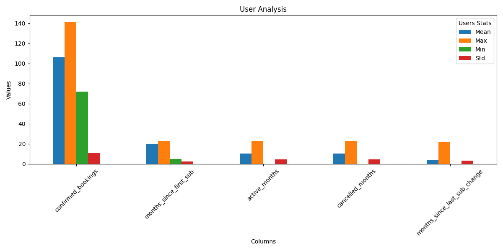

# logdiy-assignement

Python Challenge

The Goal of this challenge is to assess the following skills
• Python experience
• Logic
• Ability to write clean code
• Data cleaning
Lodgify is a SAAS company, on occasion our customers cancel their subscription and after some time subscribe again (
reactivation). Sometimes users cancel their subscription before their paid time is finished so they are still able to
use Lodgify even though they do not have an active subscription.
Two CSV Files are provided.
• Subscription History: Snapshots of the subscriptions at the last day of every month for every customer (if a customer.
If a subscription’s status is canceled on the last day of a month, we accept that they canceled their subscription at
the start of the month, so we assume that they are canceled for the whole month
• Booking history, every booking request they had gotten and with their status. In order to analyze our customer
behavior financials analysts ask for the following
data:
For every customer on the monthly grain:
• How many months has passed since their first subscription month?
• How many months they were an active/canceled subscriber?
• How many months has passed since their last subscription status change?
• How many confirmed bookings did they receive
Data for this question will be a bit dirty, two different statuses for the same user same month or a missing month
between two dates, please accept the status on previous existing/single month.
Write a python script to extract the data required by the business analyst and export to it to csv file.

The User Analysis will be saved in user_analysis.csv
[user_analysis.csv](user_analysis.csv)

# Lodgify Assignment – Python Challenge

## Objective

The goal of this challenge is to assess your ability in:

- Python proficiency  
- Logical and analytical thinking  
- Writing clean and maintainable code  
- Data cleaning and transformation
---

## Business Context

**Lodgify** is a SaaS company. Sometimes customers cancel their subscriptions and later return (reactivate).  
In some cases, users cancel their subscription **before the paid period ends**, meaning they remain active for a short time **even without an active subscription**.

---

## Provided Data

Two CSV files are provided:

1. **Subscription History**  
   Snapshots of user subscriptions taken on the **last day of each month**.  
   If a subscription appears as "canceled" on the last day, we assume the user was **canceled for the entire month**.

2. **Booking History**  
   All booking requests, including their statuses (e.g., confirmed, declined, etc.).

---

## Business Analyst Requirements

The goal is to provide a **monthly breakdown** per customer, answering the following:

For **each customer and each month**:

- How many months have passed since their **first subscription month**?
- How many months were they an **active** or **canceled** subscriber?
- How many months have passed since their **last subscription status change**?
- How many **confirmed bookings** did they receive?

### Note on Data Quality

- A customer may have **multiple statuses** in the same month or **missing months** in the timeline.
- In such cases, **use the most recent available status** to fill gaps or resolve duplicates.

---

## Implementation

A Python script processes and merges both datasets, calculates the required metrics, and exports the result as a CSV.
and plot a summary related to the user analysis

**Output File:**
[user_analysis.csv](user_analysis.csv)

**Users Summary Plot:**
